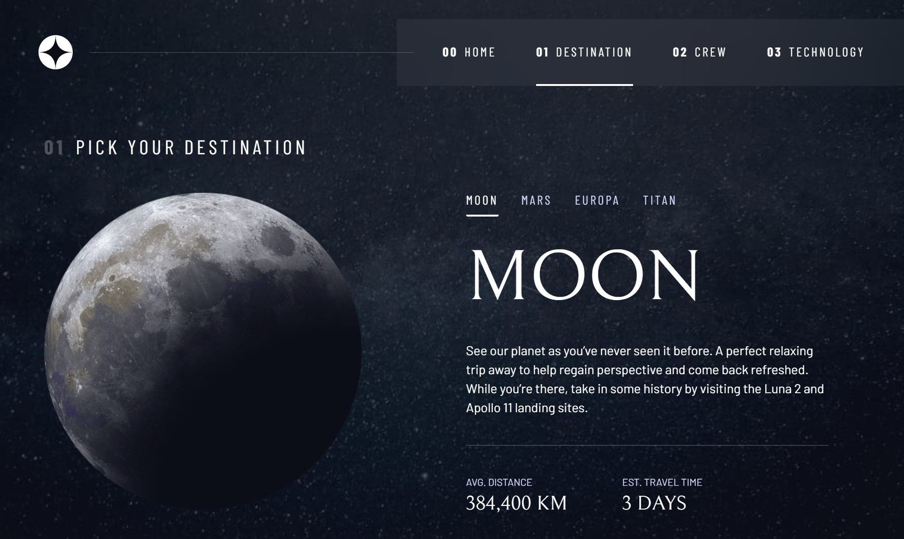
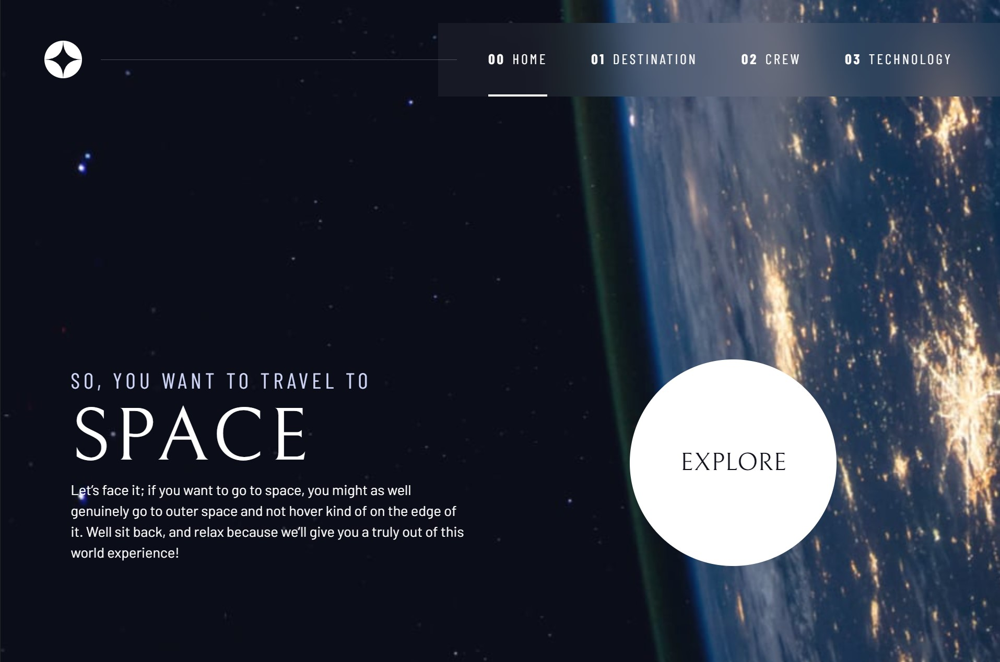

# Multi-page site: Space tourism website solution
Multipage site built from scratch using CSS Grid, Flexbox, semantic, screen-reader friendly HTML, and JavaScript 
The Live Site can be viewed here: [Live Demo](https://xyeres.github.io/space-tourism)

## Table of contents

- [Overview](#overview)
  - [The challenge](#the-challenge)
  - [Screenshot](#another-screenshot)
  - [Links](#links)
- [Built with](#built-with)

## Overview
This project is a multi-page CSS Grid-based site built from a Figma design file. This one presented several challenges in the layout of the CSS Grid, it's a fairly complex layout with variations for desktop, tablet and mobile screen sizes. I enjoyed putting this one together!  
### The challenge

Users should be able to:

- View the optimal layout for each of the website's pages depending on their device's screen size
- See hover states for all interactive elements on the page
- View each page and be able to toggle between the tabs to see new information

### Another Screenshot 

### Links
- Live Site URL: [Live Demo](https://xyeres.github.io/space-tourism)
### Built with

- Semantic HTML5 markup
- Mobile-first workflow
- Aria Screen Reading tags 
- CSS custom properties
- Flexbox
- CSS Grid
- SCSS pre-processing
